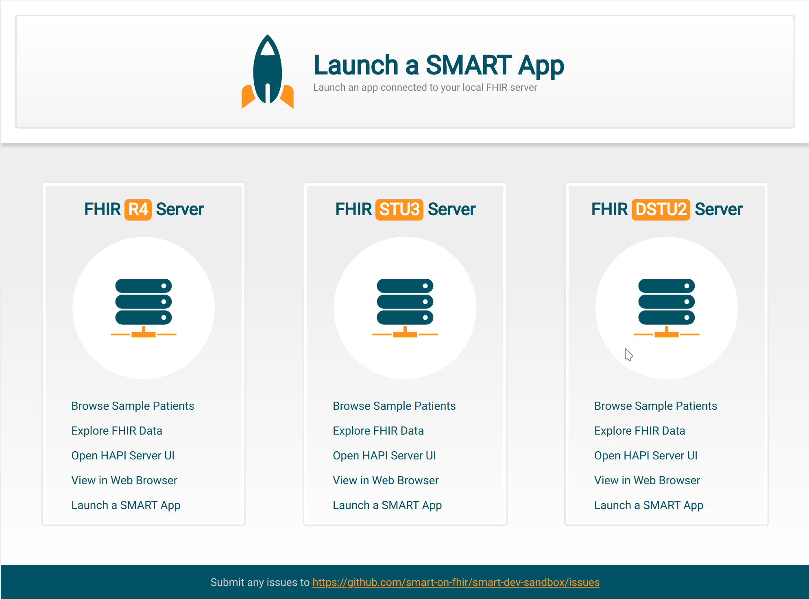

# SMART Dev Sandbox
The SMART Dev Sandbox is an open source, Docker based version of the SMART Sandbox
that can be installed locally on your machine to facilitate offline development and
the use of custom data sets.
**Please note that it is not designed for clinical use and should not be used to store or access patient medical data.**

This tool supplements the free online sandbox at https://launch.smarthealthit.org
and packages together the SMART launcher front end, DSTU2, STU3, R4 and R5 FHIR
servers based on the excellent http://hapifhir.io project, sample patient data,
an integrated web based interface to browse these sample patients, and a web based
FHIR data explorer. Additionally, these components can be set up individually from
the SMART docker images repository at https://hub.docker.com/u/smartonfhir/ (for
example, to run a local FHIR server you can type `docker run -it -p 8080:8080 smartonfhir/hapi-5:r3-full`).

Check it out and please open issues on Github if you have suggestions or run into any problems!



## System requirements
The hardware requirements are mostly depending on the number and kind of HAPI servers that you want to run.
We support 3 different servers for each FHIR version, each of which may require gigabytes of memory and
multiple CPU cores. These are configurable in the `.env` file. You should disable servers that you don't
need and give as much resources as you can to the remaining server(s).

## Configuration
The sandbox behavior is determined on startup using environment variables. These variables are defined in the
configuration file called `.env`. Once you make changes, you will need to restart the sandbox using 
`docker-compose down` and `docker-compose up`. If you change the used databases (by selecting different HAPI images)
you may also have to delete previous containers and volumes as described below.

## Start the Dev Sandbox
1. If you don't already have Docker on your system, download and install it from https://store.docker.com/search?type=edition&offering=community
2. If you don't already have Git on your system, download and install it from https://git-scm.com/downloads
3. Clone this project 
	```sh
	git clone https://github.com/smart-on-fhir/smart-dev-sandbox.git
	```
4. Change to the new directory
	```sh
	cd smart-dev-sandbox
	``` 
5. Start the Docker containers
	```sh
	docker-compose up
	```
4. It might take some time to download all the images on the first run.
   After that, it probably takes a minute to start all the services. 
5. Open http://localhost:4000 in your browser to access the sandbox.

## Stop the Dev Sandbox
To stop a running sandbox press <kbd>Ctrl+C</kbd>.  Eventually, you should see something like (depends on what services you have enabled):
```sh
Stopping launcher        ... done
Stopping hapi-r4         ... done
Stopping hapi-r3         ... done
Stopping hapi-r2         ... done
Stopping patient-browser ... done
Stopping home-page       ... done
Stopping fhir-viewer     ... done
``` 
If you don't see this output, then you will have to stop the services manually. To do so, run `docker-compose down`.

<!-- ======================================================================= -->

## FHIR Data

The HAPI FHIR servers are pre-populated with a set of sample patients and store data in Docker volumes.
You can change the configuration to start the sandbox without any existing data.

### Choosing a dataset
By default the servers will start with their "full database" that includes various generated datasets.
To reduce the number of pre-inserted patients (or to start with an empty database) you need to change
a configuration variable in the `.env` file. The name of that variable is:
- For DSTU2 - `R2_IMAGE`
- For STU3 - `R3_IMAGE`
- For r4 - `R4_IMAGE`

Please read the comments above that variable declaration to find out more about its possible values.

**WARNING**

The databases are stored in Docker volumes. Once you start a server (as part of the sandbox), a volume
will be created and persisted across further restarts. If you then decide to use a different database
and change the `RX_IMAGE` (where `X` is the numeric FHIR version) variable the sandbox may continue to use the already existing database
which leads to unpredictable behavior. To avoid that you need to remove the volume and the container
that created it first. For example for STU3 run:
```sh
docker container rm hapi-r3
docker volume rm smart-dev-sandbox_r3-database
```
Then start the sandbox as usual using `docker-compose up`. **Note** that the same can also be used to reset
a server to its initial state and quickly discard any changes that you have made to the data.


## Configuring the Patient Browser
The patient browser can filter the sample data in many ways, including by medical condition. To update
the browser's autocomplete functionality after inserting or modifying patients, install NodeJS and run
the following commands:

```sh
cd ./patient-browser

# run this the first time
npm i

# then, while the sandbox is running, to update conditions run:

# for STU2
node sync-conditions -s 2

# for STU3
node sync-conditions -s 3

# for R4
node sync-conditions -s 4

# When done restart the sandbox
cd ..
docker-compose down
docker-compose up
```

## Hosting the Sandbox
By default everything runs on `localhost` but you can change that by updating the `HOST` variable. There could
be multiple reasons for wanting to do that. For example:

1. You want the sandbox to be available on specific domain, say `sandbox.dev`. In this case add an entry to
   your hosts file to map `sandbox.dev` to `127.0.0.1` and set `HOST` in `.env` to `sandbox.dev`.
2. You want the sandbox to be accessible from every machine in your local network. Fond your LAN IP, set it
   as `HOST` in your `.env` file and restart the sandbox.
3. You want to put everything behind a proxy (perhaps to also enable SSL connections):
	1. Set up a proxy server (typically NginX or Apache) and configure it to pass requests up to localhost:port
	   for each service that you enable.
	2. Set `HOST` in your `.env` file to the domain that your proxy server is listening to.
	3. (Re)start the sandbox.


## Using Standalone Docker Images
This project composes multiple Docker images together. It is also possible to use a subset of the images
by setting the `XX_ENABLED` variable to `0` where `XX` is the name of the service that you want to exclude.

Since the images are available on the Docker hub at https://hub.docker.com/u/smartonfhir/ you can also use them
directly. For example, to start just a local STU3 HAPI FHIR server, simply run:
```sh
docker run -it -p 8080:8080 smartonfhir/hapi-5:r3-full
```

### Running the Dev Sandbox with TLS

In `docker-compose.yml`:

* Change the values for `LAUNCHER_BASE_URL` and `BASE_URL` to `https`
* Add a line in the `smart-launcher` section below `STU4_ENABLED`:

    `SSL_PORT : ${LAUNCHER_PORT}`

* change the ports line below that to:

    `- $LAUNCHER_PORT:$LAUNCHER_PORT`

In `www/template.html`:

* Search and replace `http://$HOST:$LAUNCHER_PORT` to `https://$HOST:$LAUNCHER_PORT`

And then `docker compose up` normally. Your launcher and fhir proxy will now be running with a self-signed certificate (that you'll have to approve of course).

